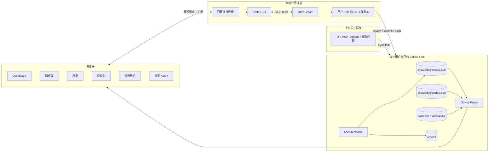
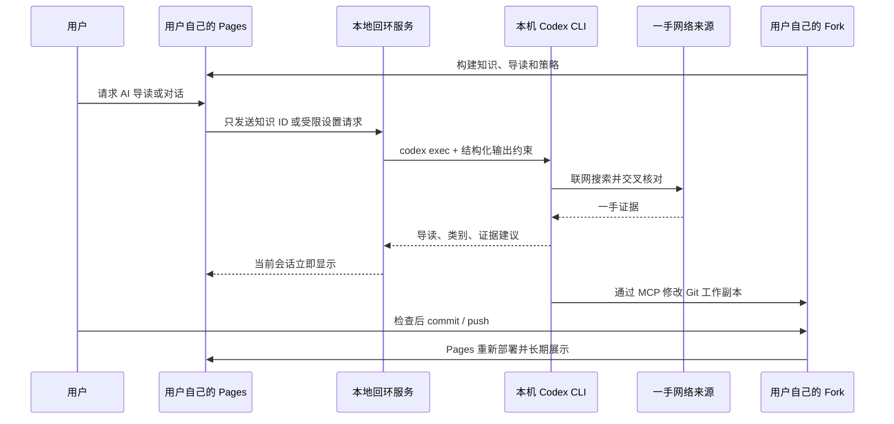

# Agent Workbench

一套可 Fork 的 Agent 工程知识工作台框架。框架代码来自上游，每个用户的知识、来源、AI 导读、策略和审计记录都由自己的 GitHub Fork 托管；本机 Codex CLI 只负责计算、MCP 控制和 Git 同步，不是知识托管层。

- 上游演示站：<https://alex-2000-m.github.io/agent-engineer-workbench/>
- 上游仓库不携带具体知识、监测源、AI 导读或带日期的审计结果；对应数据文件从空状态开始
- 网站不接收 API Key，也不保存模型凭据
- Dashboard、知识库、来源、自动化和快速开始均为独立页面

## 一眼看懂架构



数据所有权很明确：

| 内容 | 事实源 | 是否进入上游公共仓库 |
|---|---|---:|
| 知识条目 | 用户 Fork 的 `knowledge/entries.json` | 否 |
| AI 导读与核验建议 | 用户 Fork 的 `knowledge/guides.json` | 否 |
| 来源清单 | 用户 Fork 的 `watchlist/sources.json` | 否 |
| 时间和过期策略 | 用户 Fork 的 `workspace/settings.json` | 否 |
| 审计报告 | 用户 Fork 的 `knowledge/reports/` | 否 |
| UI、MCP、维护脚本 | 上游框架，经用户主动 Sync fork 更新 | 是 |

本机存在的仓库目录只是用户 Fork 的 Git 工作副本。需要长期保存的变化必须提交并推送到用户自己的 GitHub；网页不会创建另一份云端账户或本地专有知识库。

公共 `main` 的数据不变量：`knowledge/entries.json` 为 `[]`、`knowledge/guides.json` 为 `{}`、`watchlist/sources.json` 为 `[]`，`knowledge/reports/` 只保留目录占位。五类来源类型和默认过期参数属于验证框架，不是具体监测内容。

## 多页面工作台

- `/`：Dashboard，只展示指标、连接状态和今日雷达。
- `/knowledge/`：知识检索、来源摘录、AI 导读和证据说明。
- `/sources/`：五类来源视图、当前 Fork 的实际监测源和 CLI 对话示例。
- `/automation/`：新鲜度生命周期、采集/审计/归档和策略设置。
- `/quickstart/`：Fork、Pages、MCP 安装与更新教程。

页面切换和普通刷新都会使用当前标签页 `sessionStorage` 中的非敏感回环地址自动重连。显式点击“安全断开”会立即停止本地进程；关闭标签页或浏览器异常退出后，心跳停止，本地进程约 30 秒后退出。

## 快速开始

1. Fork 本仓库到自己的 GitHub 账号。
2. 在自己的 Fork 中启用 GitHub Actions 与 GitHub Pages。
3. 打开自己 Fork 部署出的 `/quickstart/` 页面。
4. 页面会自动识别当前 Fork；也可以手动粘贴自己的 HTTPS 仓库地址。
5. 复制页面生成的安装命令到终端执行。

生成的命令形态如下，仓库地址只会是用户自己的 Fork：

```bash
sh -c 'R="https://github.com/YOUR_NAME/agent-engineer-workbench.git"; D="$HOME/.agent-engineer-workbench"; if [ -d "$D/.git" ]; then O="$(git -C "$D" remote get-url origin)"; [ "$O" = "$R" ] || { echo "安装目录已连接其他仓库：$O"; exit 1; }; git -C "$D" pull --ff-only; else git clone "$R" "$D"; fi; npm --prefix "$D" install && node "$D/scripts/workbench-install.mjs"'
```

需要本机已安装并登录 Codex CLI，以及 Node.js 22 或更高版本。安装器会：

- 只克隆或更新命令中的个人 Fork；
- 自动注册 `agent-workbench` MCP；
- 从 Fork 的 Git remote 推导该用户自己的 GitHub Pages 地址；
- 启动只监听 `127.0.0.1` 的本地计算通道并打开对应网站；
- 不要求填写端口、Bridge 地址、API Key 或认证 Token。

Chrome 等浏览器首次连接时可能显示“本地网络访问”权限提示；允许自己的 Pages 站点访问本机回环服务即可。

## 更新框架

用户在 GitHub 上使用 **Sync fork** 合并上游更新，再重新运行自己的安装命令。命令只执行个人 Fork 的 `git pull --ff-only`，不会绕过 Fork 直接拉取上游仓库，也不会自动覆盖冲突。

## AI 如何驱动工作台



网页不会把整条知识重新提交给本地模型，只发送当前 Fork 中已有的知识 ID；本地服务再从该 Fork 的工作副本读取条目，降低网页注入或替换知识内容的风险。

AI 不能直接把内容标记为 `verified`。自动采集一律创建 `candidate`；AI 的 `supported / needs_review / conflict / insufficient` 只是证据建议。升级可信状态仍要求核对一手来源、固定版本、复现实验和人工审查。

## MCP 工具

整个网站是一层 MCP 可视化界面。Codex 可以读取四个资源：`workbench://snapshot`、`workbench://sources`、`workbench://knowledge` 和 `workbench://settings`；也可以使用 `manage-workbench` Prompt 把自然语言需求编排成受限工具调用。

| 网站区域 | MCP 读取面 | MCP 写入面 |
|---|---|---|
| Dashboard | 完整 Snapshot | 运行采集、复核、归档 |
| 来源 | Sources Resource | 新增、更新、移除监测源；重命名自定义类目 |
| 知识库 | Knowledge Resource | 新增候选知识、修改并重新进入待验证 |
| 自动化 | Settings Resource | 来源类型开关、定时计划、过期策略 |
| 像素桌宠 | 完整 Snapshot | 编排上述来源、策略和维护工具 |

- `get_workbench_snapshot`：读取当前 Fork 中的知识、来源、导读与设置。
- `update_workspace_settings`：调整来源类别、时间和过期策略。
- `run_knowledge_routine`：运行 `sync`、`audit` 或 `gc` 白名单任务。
- `propose_knowledge_entry`：向当前 Fork 添加带来源的 `candidate`。
- `update_knowledge_entry`：修改现有知识内容，并自动退回 `candidate`、清除旧导读。
- `upsert_watch_source`：新增或覆盖 GitHub Release / RSS 监测源。
- `remove_watch_source`：从监测清单移除来源，不删除已经沉淀的知识。
- `rename_watch_category`：批量重命名用户自定义的具体来源类目。

可以直接告诉 Codex：

```text
读取 Agent Workbench，把来源改成 GitHub、技术博客和技术报告，
每天 09:00 更新；立即运行一次采集，并告诉我有哪些候选知识需要复核。
再关注 anthropics/anthropic-sdk-python 的 Release，归为 SDK，14 天复核；
把这篇技术报告加入知识库，并将条目 abc 的工程影响改成适用于多 Agent 路由。
完成后展示 git diff，但先不要替我推送。
```

这些自然语言请求由本地 Codex 或网页像素桌宠选择并调用受限能力。来源和知识先写入个人 Fork 的 Git 工作副本；新增或编辑后的知识不能继承旧的可信状态，必须重新核验。用户查看差异后再决定是否提交并推送到自己的 GitHub。

## 知识新鲜度

```text
candidate → verified → review → stale → archived
                     ↘ quarantined
```

- Daily Radar：从 GitHub、技术博客、技术报告、新闻和其他网络知识发现变化。
- Freshness Audit：依据 `validUntil` 和个人策略将内容降级为 `review` 或 `stale`。
- Knowledge GC：长期过期内容进入 `archived`，同时保留来源与审计记录。
- AI 增强：生成导读、分类和证据建议，但不跳过人工验证。

Fork 中的三个 GitHub Actions 工作流默认维护该 Fork 自己的数据。用户可以按需修改 cron，或在 Actions 页面手动运行；上游框架仓库带有保护条件，不会运行这些个人知识任务。

## 安全边界

- 网站没有 API Key、模型端点或认证 Token 输入框，也不保存模型凭据。
- Fork 地址只在快速开始页面内存中生成命令，不写入浏览器存储。
- 本地服务使用随机端口、只监听 `127.0.0.1`，并限制为从当前 Fork 推导出的 Pages Origin。
- Bridge 与 MCP 只暴露固定能力，不接受网页传入任意 Shell 命令或脚本路径。
- 页面心跳停止后本地进程自动退出，也可显式安全断开；普通刷新不会断开。
- 外部网页和 AI 输出都视为不可信输入，不能跳过人工验证。
- 公共 Fork 与 GitHub Pages 会公开其中的知识文件；不要提交密钥、私人笔记、客户资料或内部实验数据。

## 本地开发

```bash
npm install
npm run dev
npm run lint
npm test
GITHUB_PAGES=true NEXT_PUBLIC_BASE_PATH=/agent-engineer-workbench npm run build:pages
```

单独运行当前 Fork 的知识维护：

```bash
npm run knowledge:sync
npm run knowledge:audit
npm run knowledge:gc
```

GitHub Release 同步可通过进程环境中的 `GITHUB_TOKEN` 提高 API 限额；不要把 Token 写入仓库。`DRY_RUN=1` 可以只检查发现结果。

`.github/workflows/deploy-pages.yml` 会根据执行它的仓库自动设置站点 URL、仓库链接和 `basePath`，因此 Fork 后不需要修改账号或仓库名。
