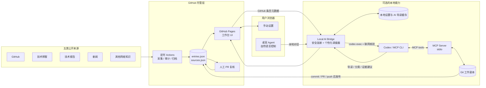
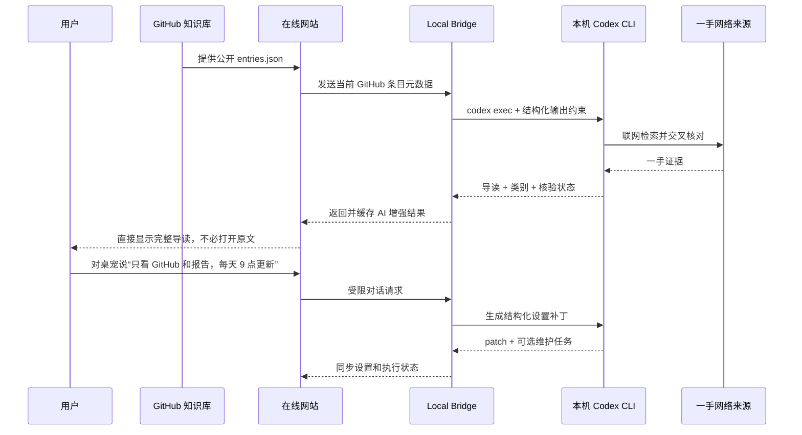

# Agent Workbench

一个由 GitHub 托管、同时可被 AI/CLI 驱动的 Agent 工程知识工作台：从五类来源发现变化，自动或人工整理知识，让陈旧内容及时退出默认检索。

- 在线网站：<https://alex-2000-m.github.io/agent-engineer-workbench/>
- 网站不接收或保存 API Key：未连接时提供公开知识、过期规则和人工复核
- 一键安装本地 MCP：本机 Codex 提供自动导读、分类、联网核验、桌宠与调度能力
- 在线知识始终来自 GitHub；本地 CLI 是计算和控制层，不是第二份在线知识源

## 一眼看懂架构



这里的“网站即 MCP”指的是：网页和 MCP Server 是同一套工作台能力的两个入口，不是让在线网站读取用户硬盘上的知识。在线知识事实源始终是 GitHub 的 `entries.json`；本地连接进程由一键安装器自动启动，只接收页面已公开展示的条目元数据，用本机 Codex 生成导读、分类和证据核验，再把结果返回页面。MCP 对本地 Git 工作副本的修改必须 commit/PR/push 后才会进入在线知识库。

## AI 如何直接驱动网站



所有 AI 都走本地 CLI/MCP：连接后立即对 GitHub 托管条目批量运行 `codex exec`，自动生成导读、分类和联网核验；桌宠也复用本机 CLI 登录与模型能力。MCP 还可更新设置、触发维护任务或在本地工作副本提出候选知识。网站没有 API Key 输入框，也不会调用浏览器侧模型接口。

AI 不能直接把知识标为 `verified`。新内容一律进入 `candidate`，AI 的 `supported / needs_review / conflict / insufficient` 只是证据建议，最终升级仍需要一手来源、版本快照、复现实验和人工审核。

## 能力分级

| 能力 | 未连接本地 CLI | 已连接本地 CLI / MCP |
|---|---:|---:|
| GitHub 托管知识与五类来源 | ✅ | ✅ |
| 手动设置来源与过期策略 | ✅ | ✅ |
| AI 导读和自动分类 | — | ✅ 自动执行 |
| 联网证据核验建议 | — | ✅ 本机 Codex 完成 |
| 桌宠自然语言控制 | — | ✅ |
| 个人定时与立即维护 | — | ✅ 页面会话期间运行 |

## 一键连接本地 CLI

需要本机已安装并登录 Codex CLI，以及 Node.js 22 或更高版本。复制网页上的同一条命令到终端：

```bash
sh -c 'D="$HOME/.agent-engineer-workbench"; if [ -d "$D/.git" ]; then git -C "$D" pull --ff-only; else git clone https://github.com/Alex-2000-m/agent-engineer-workbench.git "$D"; fi; npm --prefix "$D" install && node "$D/scripts/workbench-install.mjs"'
```

这一条命令会自动安装/更新仓库、注册 MCP、启动本地能力并打开已经连接的网站。用户不需要配置端口、地址、连接凭据或 API Key。Chrome 等浏览器首次连接时可能显示“本地网络访问”权限提示；允许本站访问本机回环服务即可。

本地服务使用随机端口，只监听 `127.0.0.1`，并只接受本站与本地开发页的 Origin。页面只在当前标签页的 `sessionStorage` 保存非敏感的本地地址，因此刷新后会自动恢复连接；不会保存 API Key、模型凭据或认证 Token。页面每 5 秒发送心跳：显式点击“安全断开”会立即停止本地进程，关闭标签页或浏览器崩溃后，本地进程会在约 30 秒内自动退出。

注册后可以直接告诉 Codex：

```text
读取 Agent Workbench，把来源改成 GitHub、技术博客和技术报告，
每天 09:00 更新；立即运行一次采集，并告诉我有哪些候选知识需要复核。
```

MCP Server 暴露四个有边界的工具：

- `get_workbench_snapshot`：读取知识、来源与设置。
- `update_workspace_settings`：调整来源类别、定时与过期策略。
- `run_knowledge_routine`：运行 `sync`、`audit` 或 `gc` 白名单任务。
- `propose_knowledge_entry`：添加带来源的 `candidate`，不能直接创建可信知识。

注意：MCP 工具修改的是本地 Git 工作副本。在线网站不会读取这份本地知识；只有提交并推送/合并到 GitHub 后，变化才会成为在线事实源。

## 知识新鲜度与验证

`knowledge/entries.json` 是 Git 事实源，`watchlist/sources.json` 定义 GitHub Release 与 RSS/Atom 来源。自动采集只创建候选，不自动采信。

```text
candidate → verified → review → stale → archived
                     ↘ quarantined
```

- 每日雷达：从 GitHub、技术博客、技术报告、新闻和其他网络知识发现变化。
- 每周审计：依据 `validUntil` 将内容降级为 `review` 或 `stale`。
- 每月 GC：长期过期内容进入 `archived`，同时保留来源与审计记录。
- AI 模式：额外生成导读、分类和交叉核验建议，但不改变可信状态。
- 人工门槛：核对一手来源、固定版本、复现实验，并通过 PR 合并。

## 本地开发与验证

```bash
npm run dev
npm run lint
npm test
GITHUB_PAGES=true NEXT_PUBLIC_BASE_PATH=/agent-engineer-workbench npm run build:pages
```

单独运行知识维护：

```bash
npm run knowledge:sync
npm run knowledge:audit
npm run knowledge:gc
```

首次同步 GitHub Release 时，可通过 `GITHUB_TOKEN` 提高 API 限额。不要将 Token 写入仓库。使用 `DRY_RUN=1` 可以只检查多来源发现结果而不修改知识文件。

## 安全边界

- 网站没有 API Key、模型端点、认证 Token 或其他长期凭据输入框；只会话级保存非敏感的本地地址以支持刷新重连。
- 本地连接进程使用随机端口、只监听 `127.0.0.1`，并严格限制允许的网页 Origin。
- 页面心跳停止后，本地进程自动退出；用户也可以显式安全断开。
- Bridge 与 MCP 只暴露固定工具，不接受网页传入任意命令、脚本路径或 Shell 参数。
- 外部网页内容一律视为不可信输入；采集与 AI 输出不能跳过人工验证。
- 公共仓库中不要提交密钥、私人笔记、客户信息或内部实验结果。

## GitHub Pages

`.github/workflows/deploy-pages.yml` 会在默认分支更新后构建并部署站点；工作流自动使用仓库名作为 `basePath`。知识采集、过期审计和归档分别由仓库中的定时 Actions 执行。
