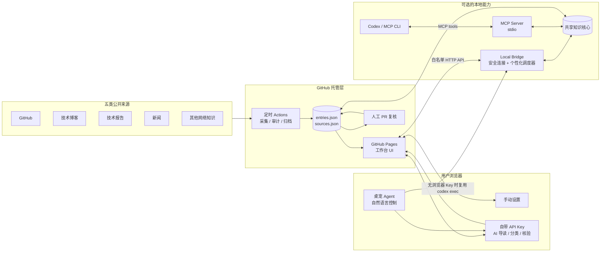
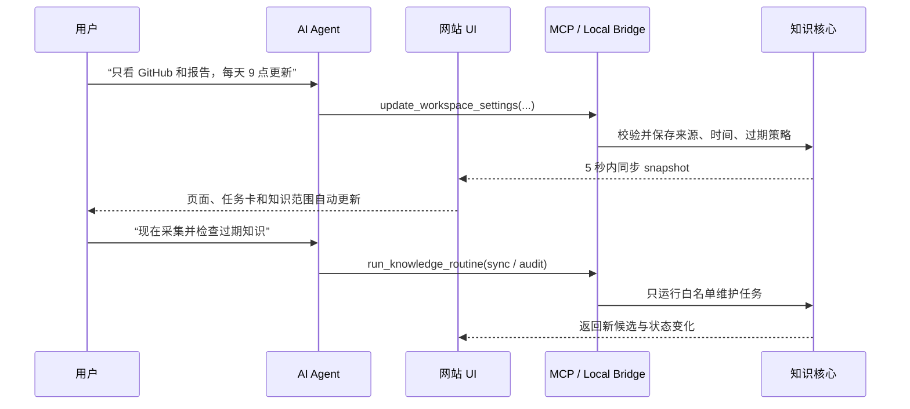

# Agent Workbench

一个由 GitHub 托管、同时可被 AI/CLI 驱动的 Agent 工程知识工作台：从五类来源发现变化，自动或人工整理知识，让陈旧内容及时退出默认检索。

- 在线网站：<https://alex-2000-m.github.io/agent-engineer-workbench/>
- 没有 API Key：自动采集 + 过期规则 + 人工复核
- 配置 API Key：自动导读 + 自动分类 + 联网证据核验建议 + 桌宠 Agent
- 连接本地 CLI：网站 UI、Codex 和其他 MCP 客户端共同操作一套本地知识核心

## 一眼看懂架构



这里的“网站即 MCP”指的是：网页和 MCP Server 是同一个工作台的两个入口。GitHub Pages 本身是静态页面，不能直接启动本机 CLI；因此仓库提供只监听 `127.0.0.1` 的 Local Bridge，让浏览器安全看到 CLI/MCP 对共享知识核心的修改。Bridge 不开放任意 Shell 执行。

## AI 如何直接驱动网站



AI 有两条控制路径：

1. 浏览器 BYOK：用户填入 API Key 后，桌宠 Agent 将自然语言转换为受限的设置补丁；网站还会自动逐条生成导读、知识类别和联网核验建议。
2. 本地 CLI/MCP：Codex 先读取工作台快照，再调用 MCP 工具更新设置、触发维护任务或提交候选知识；网页通过 Local Bridge 自动同步结果。连接成功后，即使没有浏览器 API Key，桌宠也会出现，并通过受约束的 `codex exec` 复用本机 CLI 登录与模型能力。

AI 不能直接把知识标为 `verified`。新内容一律进入 `candidate`，AI 的 `supported / needs_review / conflict / insufficient` 只是证据建议，最终升级仍需要一手来源、版本快照、复现实验和人工审核。

## 能力分级

| 能力 | 无 API Key | 浏览器配置 API Key | 本地 CLI / MCP |
|---|---:|---:|---:|
| 五类来源自动采集 | ✅ GitHub Actions | ✅ | ✅ 可立即触发 |
| 手动设置来源与策略 | ✅ | ✅ | ✅ |
| AI 导读和自动分类 | — | ✅ 自动执行 | 由本地 Agent 决定 |
| 联网证据核验建议 | — | ✅ Web Search | 由本地 Agent/MCP 决定 |
| 桌宠自然语言控制 | — | ✅ 在线模型 | ✅ 复用本地 Codex CLI |
| 关闭网页后持续运行 | 仓库级 Actions | 仓库级 Actions | ✅ Bridge 按个人时间调度 |

## 一键连接本地 CLI

需要 Node.js 22 或更高版本。

```bash
git clone https://github.com/Alex-2000-m/agent-engineer-workbench.git
cd agent-engineer-workbench
npm install
npm run workbench:bridge
```

Bridge 启动后会打印一个包含临时令牌的一键连接链接。打开该链接即可让在线网站读取本地知识；令牌只存在于进程内存和 URL fragment，不会发给 GitHub Pages 服务器，也不会写入磁盘。保持终端运行即可维持连接，并按用户设置的每日采集、每周复核和每月归档时间自动执行任务（使用本机时区）。

将同一知识核心注册给 Codex：

```bash
codex mcp add agent-workbench -- node "$(pwd)/scripts/workbench-mcp.mjs"
codex mcp list
```

注册后可以直接告诉 Codex：

```text
读取 Agent Workbench，把来源改成 GitHub、技术博客和技术报告，
每天 09:00 更新；立即运行一次采集，并告诉我有哪些候选知识需要复核。
```

MCP Server 暴露四个有边界的工具：

- `get_workbench_snapshot`：读取知识、来源与设置。
- `update_workspace_settings`：调整来源类别、定时与过期策略。
- `run_knowledge_routine`：运行 `sync`、`audit` 或 `gc` 白名单任务。
- `propose_knowledge_entry`：添加带来源的 `candidate`，不能直接创建可信知识。

## 知识新鲜度与验证

`knowledge/entries.json` 是 Git 事实源，`watchlist/sources.json` 定义 GitHub Release 与 RSS/Atom 来源。自动采集只创建候选，不自动采信。

```text
candidate → verified → review → stale → archived
                     ↘ quarantined
```

- 每日雷达：从 GitHub、技术博客、技术报告、新闻和其他网络知识发现变化。
- 每周审计：依据 `validUntil` 将内容降级为 `review` 或 `stale`。
- 每月 GC：长期过期内容进入 `archived`，同时保留来源与审计记录。
- AI 模式：额外生成导读、分类和交叉核验建议，但不改变可信状态。
- 人工门槛：核对一手来源、固定版本、复现实验，并通过 PR 合并。

## 本地开发与验证

```bash
npm run dev
npm run lint
npm test
GITHUB_PAGES=true NEXT_PUBLIC_BASE_PATH=/agent-engineer-workbench npm run build:pages
```

单独运行知识维护：

```bash
npm run knowledge:sync
npm run knowledge:audit
npm run knowledge:gc
```

首次同步 GitHub Release 时，可通过 `GITHUB_TOKEN` 提高 API 限额。不要将 Token 写入仓库。使用 `DRY_RUN=1` 可以只检查多来源发现结果而不修改知识文件。

## 安全边界

- 浏览器 API Key 只保存在页面内存，刷新即清除；静态网站没有服务端密钥保险箱，请使用限额明确的个人 Project Key。
- Local Bridge 只监听 `127.0.0.1`，要求随机临时令牌，并限制允许的网页来源。
- Bridge 与 MCP 只暴露固定工具，不接受网页传入任意命令、脚本路径或 Shell 参数。
- 外部网页内容一律视为不可信输入；采集与 AI 输出不能跳过人工验证。
- 公共仓库中不要提交密钥、私人笔记、客户信息或内部实验结果。

## GitHub Pages

`.github/workflows/deploy-pages.yml` 会在默认分支更新后构建并部署站点；工作流自动使用仓库名作为 `basePath`。知识采集、过期审计和归档分别由仓库中的定时 Actions 执行。
